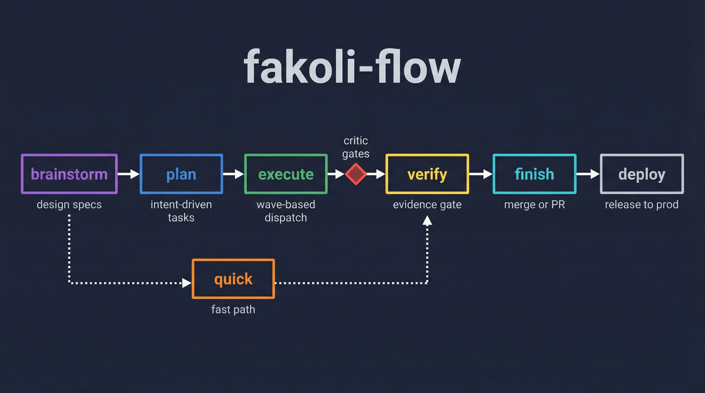

# fakoli-flow

[](LICENSE)
[](.claude-plugin/plugin.json)

Intent-driven workflow orchestration for specialist agent teams.



---

fakoli-flow coordinates specialist agents through a five-stage pipeline — brainstorm,
plan, execute, verify, finish — without prescribing how to implement anything. Plans
describe acceptance criteria, not code. Quality is enforced through critic gates after
every execution wave and evidence-based verification before shipping.

## Installation

```bash
claude plugin install fakoli-flow
```

---

## The Core Idea: Intent-Driven

Most plan-driven tools write full implementation code directly into the plan: function
bodies, test files, line-by-line instructions. By the time the agent runs, the plan is
already partially wrong. fakoli-flow plans describe **what** to achieve and let trusted
specialist agents decide **how**.

### The difference

**Prescriptive plan (what other tools generate):**

```markdown
### Task 3: Implement the retry function

- [ ] Step 1: Write failing test
\`\`\`typescript
test("retries with exponential backoff", () => {
  const result = retry(failingFn, { maxRetries: 3, initialDelay: 100 });
  expect(result.attempts).toBe(3);
  expect(result.delays).toEqual([100, 200, 400]);
});
\`\`\`

- [ ] Step 2: Implement
\`\`\`typescript
export function retry<T>(fn: () => T, opts: RetryOptions): RetryResult<T> {
  let attempt = 0;
  ...
\`\`\`
```

30+ lines, assumes types that may not exist, prescribes primitives the agent should
choose itself, stale the moment implementation diverges.

**Intent-driven plan (fakoli-flow):**

```markdown
### Task 3: Retry with exponential backoff

**Intent:** Failed executions must be retried with increasing delay before routing to the dead letter queue.

**Acceptance criteria:**
- Configurable max retries (default 3) and initial delay (default 1000ms)
- Delay doubles each attempt with ±10% jitter to prevent thundering herd
- Retries exhausted → route to DLQ, not silent failure

**Scope:** packages/orchestrator/src/retry.ts
**Agent:** welder (TDD enforced — writes failing test first)
**Verify:** `bun test` — retry scenarios pass, DLQ routing confirmed
**Depends on:** Task 2 (queue manager)
```

10 lines. The agent reads the actual codebase before implementing. If a delay utility
already exists, the agent uses it. A human can review the plan without reading code.

For full details on the philosophy: [docs/intent-driven-orchestration.md](docs/intent-driven-orchestration.md)

---

## Orientation

Run `/flow` at any time to see the available skills and detect your current project context (language, crew status). This is the entry point — start here if you are not sure which skill to use.

## Skills

| Skill | Trigger | What It Does |
|-------|---------|--------------|
| `/flow:brainstorm` | "design", "spec", "brainstorm" | One-question-at-a-time refinement → approved spec saved to `docs/specs/` |
| `/flow:plan` | "break into tasks", "create a plan" | Reads spec, runs scout to verify library/API assumptions, writes intent-driven task list to `docs/plans/` |
| `/flow:execute` | "build this", "run the plan" | Loads plan, groups tasks into dependency waves, dispatches agents in parallel, runs critic gate between waves |
| `/flow:verify` | "check this", "is this ready" | Dispatches sentinel with acceptance criteria from the plan; every PASS must cite fresh evidence (exit code, exact output) |
| `/flow:finish` | "ship it", "create PR", "merge" | Re-runs tests, presents four options: merge locally, push + PR, keep branch, or discard |
| `/flow:quick <task>` | Small fixes, bug patches | Single agent → verify → critic → done. No brainstorming, no waves |

---

## The Wave Engine

When `/flow:execute` runs a plan, it groups tasks by their declared dependencies and
dispatches agents in parallel within each wave. Every wave that writes code triggers a
mandatory critic gate before the next wave starts.

```
Wave 1 — Research  (parallel): scout reads docs, maps codebase
Wave 2 — Build     (parallel): guido + smith + herald create new artifacts
Wave 3 — Integrate (sequential): welder wires everything together
Wave 4 — Review    (parallel): critic reviews code, sentinel runs tests
Wave 5 — Fix cycle (if needed): welder fixes MUST FIX findings, critic re-reviews
```

If the critic returns MUST FIX, it dispatches welder to fix and re-runs the critic — up
to three cycles before surfacing to the user. SHOULD FIX and NIT findings are logged
but don't block the wave.

In practice across 44,268 lines of the BAARA Next project, critic gates caught 26 bugs
before they compounded: state machine violations, broken API contracts, unauthenticated
RCE, migration data corruption.

For dispatch patterns, status file protocol, and parallel agent examples:
[docs/wave-engine.md](docs/wave-engine.md)

New to fakoli-flow? Start here: [docs/getting-started.md](docs/getting-started.md)

---

## Works with fakoli-crew

fakoli-flow orchestrates; fakoli-crew provides the specialists. Each task in a
fakoli-flow plan names a crew agent by role. The wave engine dispatches them via the
Agent tool:

```
Agent(
  subagent_type = "fakoli-crew:welder",
  prompt = """
    Intent: Connect the retry module to the orchestrator's failure handling path.
    Acceptance criteria:
    - Failed executions trigger retry with exponential backoff
    - Retries exhausted → route to DLQ
    Scope: packages/orchestrator/src/orchestrator-service.ts
    Upstream context: Task 3 created retry.ts, Task 4 created queue-manager.ts
    Verify: bun test — retry scenarios pass
  """
)
```

Without fakoli-crew, the wave engine falls back to generic subagents. The pipeline still
runs — you lose the specialized expertise: TDD enforcement in welder, Staff Engineer
review depth in critic, interface-first design in guido.

Install both for the full workflow:

```bash
claude plugin install fakoli-crew
claude plugin install fakoli-flow
```

---

## Quick Mode

`/flow:quick` skips the full workflow for tasks that touch fewer than three files.

```
/flow:quick "add a timeout parameter to the retry function"

1. Detects scope — 1-2 files
2. Detects language — TypeScript (tsconfig.json found)
3. Dispatches welder: Agent(subagent_type="fakoli-crew:welder", ...)
4. Runs verification: npx tsc --noEmit && bun test
5. Dispatches critic on modified files
6. PASS → done. MUST FIX → one fix cycle → done
```

Use quick mode for bug fixes, parameter additions, import corrections, and renames.
Use the full workflow for anything you would want a spec for.

---

## Visual Companion

When brainstorming involves layout, mockups, or visual comparisons, fakoli-flow detects
this and offers to start a local browser server:

```
I can show you this in a browser — want me to fire up the visual companion?
```

The server uses PID tracking so it survives the 30-minute inactivity timeout and
auto-restarts if it crashes. Once accepted, it stays running for all subsequent visual
questions in the session. Textual questions stay in the terminal regardless.

The visual companion is never started without being offered first.

---

## Requirements

- Claude Code with plugin support
- fakoli-crew (recommended — provides specialist agents for wave execution; falls back
  to generic subagents if not installed)

---

## Author

Sekou Doumbouya — [github.com/fakoli](https://github.com/fakoli)

## License

MIT — see [LICENSE](LICENSE)
