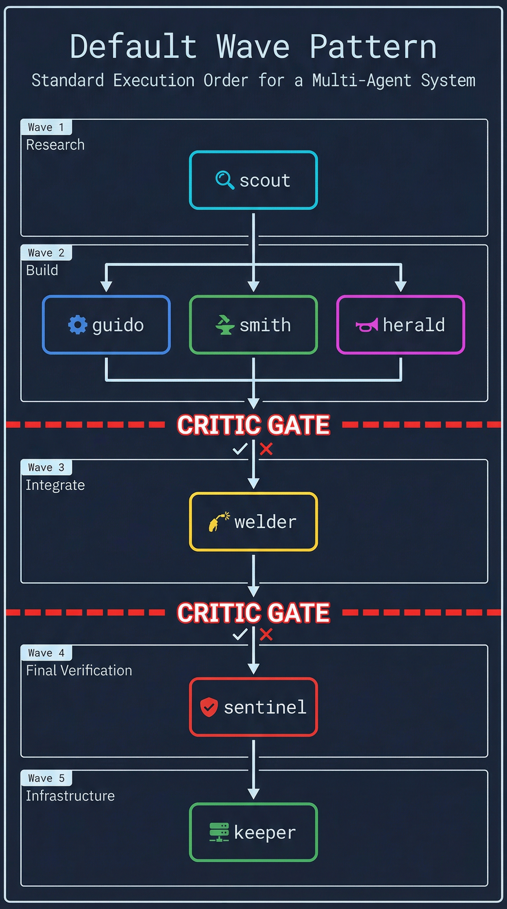
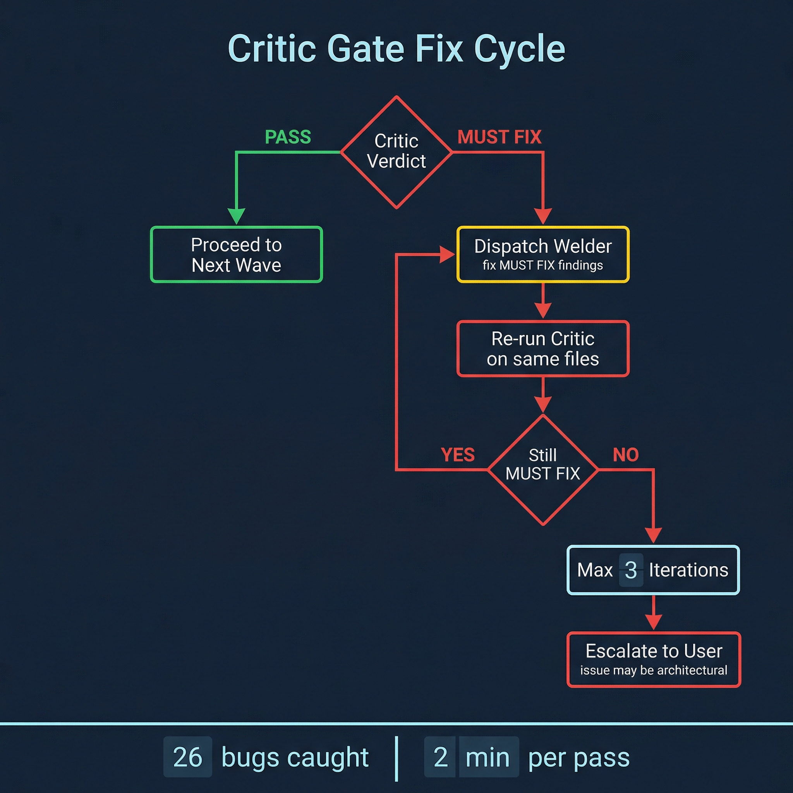

# Wave Engine Quick Reference

Quick reference for `/flow:execute` wave assignment, dispatch syntax, critic gate protocol, and language verification.

## Wave Assignment

### From Declared Dependencies

Each task in the plan can declare `Depends on:` to set its wave automatically:

```markdown
### Task 5: Wire retry into orchestrator

**Intent:** Connect the retry module to the orchestrator's failure handling path.
**Depends on:** Task 3 (retry module), Task 4 (queue manager)
**Agent:** welder
```

Assignment rules:

| Condition | Wave |
|-----------|------|
| No `Depends on:` | Wave 1 |
| Depends only on Wave 1 tasks | Wave 2 |
| Depends on any Wave 2 task | Wave 3 |
| Depends on any Wave N task | Wave N+1 |

Tasks within the same wave are independent — they run in parallel without conflict.

### Default Pattern (No Dependencies Declared)

When the plan does not declare explicit dependencies, the wave engine uses the crew's natural wave pattern:



## Parallel Dispatch Syntax

Dispatch via the Agent tool. Each agent receives only its own task — no full plan, no
other agents' history.

```
Agent(
  subagent_type = "fakoli-crew:welder",
  model = "sonnet",
  prompt = """
    Task: Wire retry into orchestrator

    Intent: Connect the retry module to the orchestrator's failure handling path.

    Acceptance criteria:
    - Failed executions trigger retry with exponential backoff
    - Retries exhausted → route to DLQ
    - Each retry creates a new execution attempt

    Scope: packages/orchestrator/src/orchestrator-service.ts

    Upstream context:
    - Task 3 created retry.ts with shouldRetry() and calculateDelay()
    - Task 4 created queue-manager.ts with enqueueTimer()

    Verify: bun test — retry scenarios pass
  """
)
```

**What the agent receives:**
- Intent — what to achieve (from the plan)
- Acceptance criteria — how to verify it is done (from the plan)
- Scope — which files to focus on (from the plan)
- Upstream context — decisions from prior waves (from agent status files)
- Verify command — how to confirm success (from the plan)

**What the agent does NOT receive:**
- Implementation code — the agent decides how
- The full plan — only its own task
- Other agents' conversation history — each agent has fresh context

**Graceful degradation:** If fakoli-crew is not installed, replace `fakoli-crew:welder`
with `general-purpose`. The pipeline runs; you lose specialized expertise.

## Critic Gate Protocol

The critic gate runs after every wave that writes code. It is non-negotiable.

### Step-by-Step

1. **Collect modified files.** Read all `docs/plans/agent-*-status.md` files from the
   completed wave. Extract the "Files Modified" section from each.

2. **Dispatch critic.**
   ```
   Agent(
     subagent_type = "fakoli-crew:critic",
     prompt = "Review these files modified in Wave 2: [file list].
               Check against these acceptance criteria: [from plan].
               Report MUST FIX / SHOULD FIX / CONSIDER / NIT."
   )
   ```

3. **Evaluate findings.**

   | Finding level | Action |
   |--------------|--------|
   | All PASS | Proceed to next wave |
   | SHOULD FIX / CONSIDER / NIT only | Proceed — log findings for later |
   | MUST FIX found | Enter fix cycle |

4. **Fix cycle.**

   

### Severity Definitions

| Level | Meaning | Blocks wave? |
|-------|---------|-------------|
| MUST FIX | Correctness bug, security issue, broken contract | Yes |
| SHOULD FIX | Code quality issue with real impact | No — logged |
| CONSIDER | Architectural concern worth discussing | No — logged |
| NIT | Style, naming, minor cleanup | No — logged |

## Language Verification Commands

Run after wave completion, before the critic gate. If verification fails, dispatch welder
to fix the errors — do not proceed to the critic with broken code.

| Language | Detection File | Verification Command | What It Catches |
|----------|---------------|---------------------|-----------------|
| TypeScript | `tsconfig.json` | `npx tsc --noEmit` | Type errors, import mismatches |
| Python | `pyproject.toml` | `ruff check . && mypy .` | Lint violations, type errors |
| Rust | `Cargo.toml` | `cargo check` | Borrow checker, type errors, lifetime issues |
| Any | plan's `Verify:` field | command from plan | Failing tests from the current wave |

Language is detected by the SessionStart hook reading the project root: `Cargo.toml` →
Rust, `pyproject.toml` → Python, `tsconfig.json` / `package.json` → TypeScript.

## Agent Capabilities

| Agent | Creates Files | Modifies Files | Reviews Only | Best For |
|-------|--------------|----------------|--------------|----------|
| scout | Yes (research) | No | No | API docs, codebase exploration |
| guido | Yes (new modules) | No | No | Interface design, type patterns |
| smith | Yes (manifests) | Yes (plugin structure) | No | Plugin manifests, commands, hooks |
| herald | Yes (READMEs) | Yes (docs) | No | Documentation, branding |
| welder | Yes (shims) | Yes (integration) | No | Wiring, backward compat |
| keeper | No | Yes (infra) | No | CLAUDE.md, CI, registry |
| critic | No | No | Yes | Code review, debugging |
| sentinel | No | No | Yes | Testing, verification |

## Status File Location

Agents write their results to `docs/plans/agent-<name>-status.md`. The wave engine reads
these to confirm completion, detect blockers, extract modified files for the critic, and
pass decisions to the next wave's dispatch prompts.

See `references/status-protocol.md` for the full format specification.
