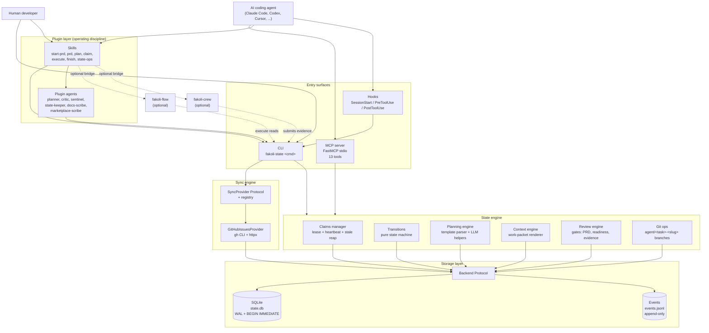
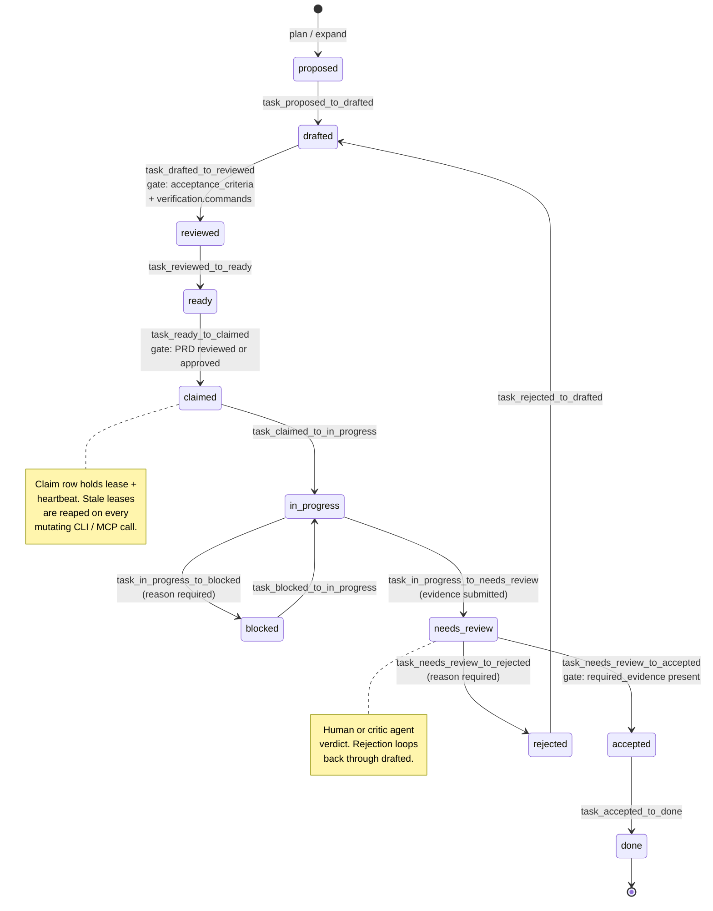
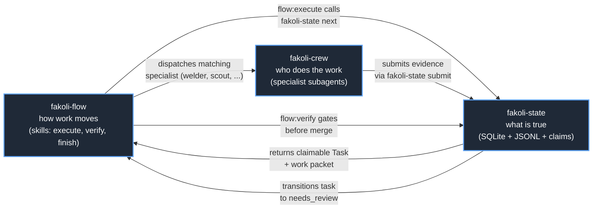

# fakoli-state architecture

> Condensed reference for the **shipped v1.10.0** state. For the original v0
> vision and aspirational items, see
> [`specs/2026-05-24-fakoli-state-v0.md`](specs/2026-05-24-fakoli-state-v0.md).
> For what is planned but not yet shipped, see
> [`roadmap.md`](roadmap.md).
>
> This document is intentionally short — readable in ten minutes — and
> describes only what exists on disk today. Every entity, command, tool, and
> hook listed here has a file pointer; if it isn't pointed at, it doesn't
> ship.

---

## Mental model

fakoli-state is to agentic software work what Terraform is to infrastructure:
a canonical state file holds the truth, derived views (work packets, markdown
plans, dependency graphs) are projected from it, and the plan-then-apply
rhythm gates execution behind review. The PRD is the configuration; the
SQLite database is the state; `fakoli-state apply` is the commit point that
records evidence and transitions a task to `done`. Drift (stale claims,
orphan branches, sync conflicts) is detected and reconciled, not papered
over.

In the Fakoli ecosystem, fakoli-state plays the **what is true** role of the
plugin trinity:

- `fakoli-flow` defines how work moves (skill choreography, gates, merges).
- `fakoli-crew` defines who does the work (specialist subagents).
- `fakoli-state` defines what is true (the durable record).

The three plugins compose. When all three are installed, `flow:execute` reads
`fakoli-state next`, dispatches the right crew specialist, and submits
evidence back to canonical state before the merge gate. When fakoli-state is
absent, flow and crew fall back to their markdown-status conventions.

The full positioning (the trinity sentence, the five wedges, the Terraform
analogy) is maintained in [`_positioning.md`](_positioning.md); this
document does not duplicate that material.

---

## Component layers



Source: [`assets/diagrams/component.mmd`](../assets/diagrams/component.mmd).

### Per-layer responsibilities

| Layer | What it owns | Key files |
|---|---|---|
| Plugin manifest | Discoverability, version, keywords | [`.claude-plugin/plugin.json`](../.claude-plugin/plugin.json) |
| CLI | Pure state operations — CRUD, scoring, packet generation, sync. No workflow choreography. | [`bin/src/fakoli_state/cli/__init__.py`](../bin/src/fakoli_state/cli/__init__.py) |
| MCP server | Runtime-neutral capability surface — 13 stdio tools any MCP client can call | [`bin/src/fakoli_state/mcp_server.py`](../bin/src/fakoli_state/mcp_server.py) |
| Hooks | Non-blocking enforcement the model would otherwise forget | [`hooks/hooks.json`](../hooks/hooks.json), [`hooks/*.sh`](../hooks/) |
| Skills | Workflow choreography — one-question-at-a-time, propose approaches, gate transitions | [`skills/*/SKILL.md`](../skills/) |
| Plugin agents | Specialist roles owned by this plugin; defer to fakoli-crew when installed | [`agents/*.md`](../agents/) |
| Backend protocol | The seam between state-engine logic and storage; SqliteBackend is the only impl that ships | [`bin/src/fakoli_state/state/backend.py`](../bin/src/fakoli_state/state/backend.py), [`bin/src/fakoli_state/state/sqlite.py`](../bin/src/fakoli_state/state/sqlite.py) |
| Transitions | Pure state machine — no I/O, no DB, no side-effects beyond `model_copy()` | [`bin/src/fakoli_state/state/transitions.py`](../bin/src/fakoli_state/state/transitions.py) |
| Claims manager | Atomic lease + heartbeat; stale detection on every operation | [`bin/src/fakoli_state/claims/manager.py`](../bin/src/fakoli_state/claims/manager.py), [`bin/src/fakoli_state/claims/stale.py`](../bin/src/fakoli_state/claims/stale.py) |
| Planning engine | Template-first PRD parser; optional LLM augmentation; deterministic six-dim scorer | [`bin/src/fakoli_state/planning/`](../bin/src/fakoli_state/planning/) |
| Context engine | Renders work packets (markdown + JSON) from canonical state | [`bin/src/fakoli_state/context/packets.py`](../bin/src/fakoli_state/context/packets.py) |
| Review engine | Pure transition-gate functions (readiness, evidence) | [`bin/src/fakoli_state/review/gates.py`](../bin/src/fakoli_state/review/gates.py) |
| Git ops | Auto-create `agent/<task>-<slug>` branch on `claim`; optional worktree | [`bin/src/fakoli_state/git_ops/`](../bin/src/fakoli_state/git_ops/) |
| Sync engine | Bidirectional GitHub Issues projection via the `SyncProvider` Protocol | [`bin/src/fakoli_state/sync/`](../bin/src/fakoli_state/sync/) |

The two iron rules of the layering:

1. **CLI is the one-and-only mutator.** Hooks shell out to the CLI; the MCP
   server opens a `SqliteBackend` directly but only via the same engine
   functions the CLI uses. Skills and agents do not write to `.fakoli-state/`
   directly — they call the CLI.
2. **Transitions are pure.** Every status change is a function from
   `(entity, context) -> new entity`. Persisting the result is the backend's
   job, not the transition's. This is what makes the JSONL replay possible.

---

## Data model

The full type system lives in
[`bin/src/fakoli_state/state/models.py`](../bin/src/fakoli_state/state/models.py)
— **25 Pydantic v2 classes** total (11 enums + 14 models). Every field is
validated at every transition (`extra="forbid"`,
`validate_assignment=True`); all timestamps are UTC-required.

### Enums (11)

| Enum | Values | Purpose |
|---|---|---|
| `PRDStatus` | draft, reviewed, approved, rejected | Gates task claimability |
| `FeatureStatus` | proposed, ready, in_progress, done | Coarse-grain status on a Feature |
| `TaskStatus` | proposed, drafted, reviewed, ready, claimed, in_progress, blocked, needs_review, accepted, done, rejected | The 11-status task lifecycle (see [Task lifecycle](#task-lifecycle)) |
| `TaskPriority` | low, medium, high, critical | Sort key for `fakoli-state next` |
| `ClaimType` | task, feature, file_scope, exploratory | Distinguishes whole-task vs partial leases |
| `ClaimStatus` | active, released, stale, force_released | Lease lifecycle |
| `ReviewTargetKind` | prd, task, feature | What a `Review` row points at |
| `ReviewDecision` | approve, reject, needs_changes | Reviewer verdict |
| `ExternalSystem` | github_issues | Canonical first-party provider ids (extensible via registry) |
| `SyncState` | in_sync, local_ahead, remote_ahead, conflict, external_deleted, remote_unknown | Per-mapping conflict / health label |
| `ConflictResolutionStrategy` | local_wins, remote_wins, prompt, manual_merge | How to resolve a divergence |

### Embedded value objects (2)

| Model | Purpose |
|---|---|
| `Score` | Six-dimension scoring on a Task: complexity, parallelizability, context_load, blast_radius, review_risk, agent_suitability (each 1-5 or null) |
| `Verification` | Embedded on Task: `commands`, `manual_steps`, `required_evidence` — the contract the evidence gate checks against |

### Top-level entities (12)

| Entity | Purpose |
|---|---|
| `Project` | Root entity that owns all other entities in the database |
| `PRD` | Product Requirements Document — the gate that controls task claimability |
| `Requirement` | A single atomic requirement derived from a section of the PRD |
| `Feature` | A logical grouping of tasks that delivers a user-observable capability |
| `Task` | The primary unit of work — claimable, scoreable, evidence-backed |
| `Claim` | An exclusive lease that an agent holds on a Task while working on it |
| `Evidence` | Completion evidence submitted by an agent after finishing a Task |
| `Decision` | An architectural or design decision recorded for audit and context |
| `Review` | A human or agent review verdict on a PRD, Task, or Feature |
| `Event` | An immutable append-only log entry; monotonic id `E000001`, `E000002`, ... |
| `SyncMapping` | Tracks a Task's relationship to an issue in an external system |
| `ConflictGroup` | A named set of tasks whose `expected_files` overlap |

Type aliases (`TaskID`, `FeatureID`, `RequirementID`, `ClaimID`, `EvidenceID`,
`DecisionID`, `ReviewID`, `EventID`) are plain `str` newtypes — no runtime
overhead but grep-able at every call site.

The shared model config on every entity:

```python
_MODEL_CONFIG = ConfigDict(
    frozen=False,             # mutable for state transitions
    validate_assignment=True, # but assignment-validated end-to-end
    extra="forbid",           # unknown fields are an error
)
```

---

## Task lifecycle



Source: [`assets/diagrams/lifecycle.mmd`](../assets/diagrams/lifecycle.mmd).

All 11 statuses are defined in `TaskStatus` and the allowed transitions are
the public functions in
[`bin/src/fakoli_state/state/transitions.py`](../bin/src/fakoli_state/state/transitions.py).
The module is pure (no I/O); each function returns a new `Task` via
`model_copy(update=...)`.

### Gates on the lifecycle

Three named gates appear in the transition module; each raises
`TransitionError(gate_name=...)` with a structured error envelope:

| Gate | Where it fires | What it checks |
|---|---|---|
| `readiness_gate` | drafted → reviewed | `task.acceptance_criteria` and `task.verification.commands` must both be non-empty |
| `prd_status_gate` | ready → claimed | Project PRD must be in `reviewed` or `approved` (refuses while `draft`) |
| `evidence_gate` | needs_review → accepted | Every item in `task.verification.required_evidence` must appear as a substring of at least one Evidence field |

### Who drives each transition

| Transition | Typical driver | CLI verb |
|---|---|---|
| proposed → drafted → reviewed → ready | Planner agent or human via `plan` / `review` | `fakoli-state plan`, `fakoli-state review tasks` |
| ready → claimed | Coding agent (or human) | `fakoli-state claim T012` |
| claimed → in_progress | Auto on first heartbeat or file change | (implicit) |
| in_progress ↔ blocked | Agent or human | `fakoli-state hook ... block` |
| in_progress → needs_review | Coding agent submitting evidence | `fakoli-state submit T012 ...` |
| needs_review → accepted or rejected | Human reviewer or critic agent | `fakoli-state apply T012 --approve` / `--reject` |
| accepted → done | Auto on `apply --approve` | (implicit) |
| rejected → drafted | Author revises and re-submits | `fakoli-state plan` (re-edit) |

Only `drafted ↔ ready` and the `blocked` toggle are exposed via the
`update_task_status` MCP tool; all other transitions require a more
specific CLI verb (claim, submit, apply) so that the necessary
side-effects (lease creation, evidence write, claim release) happen
atomically.

---

## Event log and JSONL replay

Every state mutation appends one `Event` row to two places:

1. The `events` table inside `state.db` (assigned the monotonic id
   `E000001`, `E000002`, ... inside the same `BEGIN IMMEDIATE`
   transaction that mutated state).
2. `events.jsonl` — a newline-delimited JSON mirror, append-only, written
   after the SQLite commit succeeds.

The replay guarantee is the central audit property of the engine: **replaying
`events.jsonl` from an empty database must reconstruct canonical SQLite state
exactly**. This is what makes the engine safe to back up by copying
`.fakoli-state/` and what makes a corrupted database recoverable.

A native `fakoli-state replay --from-events events.jsonl` subcommand is
planned for v2.1 (item P9B-7 — see
[`roadmap.md` § Snapshot / replay](roadmap.md#theme-snapshot--replay)) and
**does not ship today**. Until it does, the supported backup and recovery
flow is to copy `.fakoli-state/` wholesale; the replay guarantee makes
that safe and minimal:

```bash
# Back up before destructive work.
cp -r .fakoli-state /backup/location/fakoli-state-$(date +%Y-%m-%d)

# Recover from a corrupted state.db by restoring the backup.
rm -f .fakoli-state/state.db .fakoli-state/state.db-wal .fakoli-state/state.db-shm
cp /backup/location/fakoli-state-YYYY-MM-DD/state.db .fakoli-state/state.db
```

`events.jsonl` is the durable audit log even without replay tooling —
commit it to git alongside the repo and you have a distributed audit
trail recoverable from any clone.

Event ids are assigned inside the lock, not before it, to eliminate a
read-before-lock race surfaced in PR #41 (Critic-3). The `Event.id`
validator accepts a `"PENDING"` sentinel so callers can defer id
assignment to the backend's `apply_event` method.

---

## Storage layout

`fakoli-state init` scaffolds this layout inside the user's project root
(not inside the plugin):

```text
<user-project>/.fakoli-state/
├── config.yaml         # project-level config (sync providers, lease defaults, ...)
├── state.db            # SQLite — the canonical state (WAL mode)
├── events.jsonl        # append-only audit / event log (replay source)
├── prd.md              # the PRD source (edited by hand; re-parsed via `prd parse`)
└── packets/            # generated work packets (per-task markdown / json)
```

A `snapshots/` subdirectory was originally planned (and is shown in the v0
spec) but the `fakoli-state snapshot` subcommand has not yet shipped — see
[Roadmap → v2.1 → snapshot subcommand](roadmap.md#theme-snapshot--replay).
Backups today are done by copying `.fakoli-state/` wholesale; the replay
guarantee makes that safe.

`hooks` and the CLI alike resolve `STATE_DIR` relative to
`${CLAUDE_PROJECT_DIR:-$PWD}/.fakoli-state` so every agent invocation,
regardless of cwd at call time, addresses the same project's state.

---

## Concurrency model

Multiple humans and multiple agents must coordinate on the same canonical
state without stepping on each other. fakoli-state achieves this with four
mechanisms layered together:

1. **SQLite WAL + `BEGIN IMMEDIATE`.** Every mutating operation runs inside
   an immediate-mode transaction, so concurrent writers serialize at the
   SQLite layer. Reads use WAL snapshots and do not block writers.
2. **Claim leases with heartbeats.** A `Claim` row carries
   `lease_expires_at` and `last_heartbeat_at`. The CLI's `renew` command
   (and the MCP `renew_claim` tool) extends the lease. Default lease is 60
   minutes (configurable via `.fakoli-state/config.yaml`); the in-code
   default lives at [`claims/manager.py`](../bin/src/fakoli_state/claims/manager.py).
3. **Stale-claim reaping.** Every mutating CLI command and every mutating
   MCP tool calls
   [`detect_and_release_stale()`](../bin/src/fakoli_state/claims/stale.py)
   at entry. Leases past their expiry are auto-released with
   `release_reason="stale"`; the audit event preserves the original
   claimant. Read-only listers skip reaping for latency.
4. **Conflict groups.** A `ConflictGroup` row names a set of tasks whose
   `expected_files` overlap. `fakoli-state next` and the
   `get_next_task` MCP tool refuse to surface a task whose conflict group
   already has an active claim — preventing two agents from being routed
   to overlapping work even when neither task is itself claimed.

The PreToolUse `check-claim.sh` hook adds a final layer of safety at the
Claude Code editor surface: before an Edit / Write / NotebookEdit fires,
the hook asks the CLI whether the current actor holds a claim covering the
target file, and surfaces a warning (non-blocking, per the hook contract)
when no claim is held.

---

## Integration with fakoli-flow and fakoli-crew



Source: [`assets/diagrams/trinity.mmd`](../assets/diagrams/trinity.mmd).

Three patterns make this composition safe across plugins:

- **Explicit detection.** Every skill that bridges to a sibling plugin
  performs an explicit `claude plugin list 2>/dev/null | grep -q
  "^fakoli-flow"` (or fakoli-crew) check before invoking it. No fuzzy
  detection by prose; the shell-exit code is the contract.
- **Graceful fallback.** When a sibling is absent, the skill falls
  through to its plugin-local equivalent (e.g., fakoli-state's own
  `sentinel` agent if `fakoli-crew:sentinel` is not installed).
- **State is the rendezvous.** Flow does not call crew directly to ask
  for a result; crew submits evidence to fakoli-state, and flow polls
  state's `needs_review` queue. This keeps each plugin's blast radius
  bounded and prevents tight coupling between flow's skills and crew's
  agents.

---

## CLI / MCP / hooks surface

### CLI commands (14 top-level + 4 sub-apps)

Full reference is forthcoming at
[`docs/cli-reference.md`](cli-reference.md). The top-level commands assembled
in [`bin/src/fakoli_state/cli/__init__.py`](../bin/src/fakoli_state/cli/__init__.py):

- Lifecycle setup: `init`, `status`
- PRD authoring: `prd parse`, `prd review` (sub-app)
- Planning: `plan`, `score`, `expand`, `review tasks` (sub-app)
- Listing / inspecting: `list`, `show`
- Claiming: `claim`, `release`, `renew`, `next`
- Working: `packet`, `submit`, `apply`
- Hooks: `hook ...` (sub-app — called by `hooks/*.sh`)
- Sync: `sync ...` (sub-app — `sync github`, `sync github --health`, ...)

### MCP tools (13)

Full reference is at [`docs/mcp.md`](mcp.md). Source:
[`bin/src/fakoli_state/mcp_server.py`](../bin/src/fakoli_state/mcp_server.py).

| # | Tool | Mutates | Reaps stale |
|---|---|---|---|
| 1 | `get_project_summary` | no | yes |
| 2 | `list_tasks` | no | no |
| 3 | `get_task` | no | no |
| 4 | `get_next_task` | no | no |
| 5 | `claim_task` | yes | yes |
| 6 | `release_task` | yes | yes |
| 7 | `renew_claim` | yes | yes |
| 8 | `generate_work_packet` | no | no |
| 9 | `submit_progress` | yes (audit-only) | yes |
| 10 | `submit_completion_evidence` | yes | yes |
| 11 | `check_conflicts` | no | no |
| 12 | `get_dependency_graph` | no | no |
| 13 | `update_task_status` | yes | yes |

Sync tools (`sync_run`, `sync_health`, `sync_status`, `sync_reconcile`) are
not yet on the MCP surface — agents that want sync today shell out via Bash
to `fakoli-state sync`. See
[Roadmap → v2.1 → MCP sync tools](roadmap.md#theme-mcp-surface-sync-tools).

### Hooks (4)

Wired in [`hooks/hooks.json`](../hooks/hooks.json). All four are
**non-blocking**: they must `exit 0` regardless of internal failure, must
not use `set -e` / `set -u` / `set -o pipefail`, must wrap CLI calls with
`|| true`, and must complete in well under their declared timeout.

| Hook | Trigger | Script | Purpose |
|---|---|---|---|
| `detect-state` | SessionStart | [`detect-state.sh`](../hooks/detect-state.sh) | Surface project state info into the session context |
| `check-claim` | PreToolUse on `Edit / Write / NotebookEdit` | [`check-claim.sh`](../hooks/check-claim.sh) | Warn (non-blocking) if the agent has no active claim covering the file |
| `record-file-change` | PostToolUse on `Edit / Write / NotebookEdit` | [`record-file-change.sh`](../hooks/record-file-change.sh) | Record the change against the active claim for orphan detection |
| `capture-evidence` | PostToolUse on `Bash` | [`capture-evidence.sh`](../hooks/capture-evidence.sh) | When the command matches a verification pattern, buffer it as evidence for the active claim |

### Skills (7)

Workflow choreography lives in [`skills/*/SKILL.md`](../skills/) —
start-prd, prd, plan, claim, execute, finish, state-ops. Verification is
delegated to `fakoli-flow:verify` and `fakoli-crew:sentinel` rather than a
plugin-local verify skill (intentional — see README rationale).

### Plugin agents (6)

Defined in [`agents/*.md`](../agents/):

- `planner` — drafts feature / task decomposition from a parsed PRD
- `critic` — reviews PRD or task drafts; produces an approve / reject / needs_changes verdict
- `sentinel` — pre-merge verification (plugin-local fallback when fakoli-crew:sentinel is absent)
- `state-keeper` — operational hygiene: orphan claims, drift, schema migrations
- `docs-scribe` — keeps `docs/` synchronised with shipped behaviour
- `marketplace-scribe` — keeps the marketplace entry, README, and CHANGELOG honest after each release

Each agent's frontmatter pins `tools:` (least privilege) and declares its
defer-to relationships with fakoli-crew counterparts.

---

## Where to read the code

Map from architectural layer to source file. Every layer of this document
points at a file you can grep.

| Layer | File(s) |
|---|---|
| Entry: CLI assembly | [`bin/src/fakoli_state/cli/__init__.py`](../bin/src/fakoli_state/cli/__init__.py) |
| Entry: MCP server (13 tools) | [`bin/src/fakoli_state/mcp_server.py`](../bin/src/fakoli_state/mcp_server.py) |
| Entry: hooks manifest | [`hooks/hooks.json`](../hooks/hooks.json) |
| Type system | [`bin/src/fakoli_state/state/models.py`](../bin/src/fakoli_state/state/models.py) |
| Transitions (pure) | [`bin/src/fakoli_state/state/transitions.py`](../bin/src/fakoli_state/state/transitions.py) |
| Backend Protocol | [`bin/src/fakoli_state/state/backend.py`](../bin/src/fakoli_state/state/backend.py) |
| SQLite impl + schema | [`bin/src/fakoli_state/state/sqlite.py`](../bin/src/fakoli_state/state/sqlite.py), [`schema.py`](../bin/src/fakoli_state/state/schema.py) |
| Event payloads | [`bin/src/fakoli_state/state/payloads.py`](../bin/src/fakoli_state/state/payloads.py) |
| Claims manager | [`bin/src/fakoli_state/claims/manager.py`](../bin/src/fakoli_state/claims/manager.py) |
| Stale reaping | [`bin/src/fakoli_state/claims/stale.py`](../bin/src/fakoli_state/claims/stale.py) |
| Planning (template + LLM + scoring) | [`bin/src/fakoli_state/planning/`](../bin/src/fakoli_state/planning/) |
| Context (work packets) | [`bin/src/fakoli_state/context/packets.py`](../bin/src/fakoli_state/context/packets.py) |
| Review gates | [`bin/src/fakoli_state/review/gates.py`](../bin/src/fakoli_state/review/gates.py) |
| Git ops | [`bin/src/fakoli_state/git_ops/`](../bin/src/fakoli_state/git_ops/) |
| Sync Protocol + registry | [`bin/src/fakoli_state/sync/provider.py`](../bin/src/fakoli_state/sync/provider.py), [`registry.py`](../bin/src/fakoli_state/sync/registry.py) |
| GitHub provider | [`bin/src/fakoli_state/sync/providers/github_issues.py`](../bin/src/fakoli_state/sync/providers/github_issues.py) |
| Reconciliation | [`bin/src/fakoli_state/sync/reconciliation.py`](../bin/src/fakoli_state/sync/reconciliation.py) |
| Plugin config | [`bin/src/fakoli_state/config.py`](../bin/src/fakoli_state/config.py) |
| Clock abstraction | [`bin/src/fakoli_state/clock.py`](../bin/src/fakoli_state/clock.py) |

---

## What is NOT here yet

This document describes shipped v1.10.0 behaviour only. The full backlog of
planned-but-not-yet-shipped items is in [`roadmap.md`](roadmap.md);
the high-level buckets:

- **v2.0 — sync providers + immediate-apply resolution.**
  - `LinearIssuesProvider` (GraphQL transport).
  - `MondayBoardsProvider` (REST + JSON, people-columns).
  - Webhook-based sync as an alternative to polling (spec-first).
  - `*_applied` conflict-resolution variants — wiring the
    `remote_wins_applied` / `local_wins_applied` deferrals at
    `cli/sync.py:1054, :1068`.
  - Provider config schemas in `config.yaml` (per-provider settings).
- **v2.1 — follow-on capability.**
  - `JiraIssuesProvider` (per-project workflow discovery).
  - `GitHubProjectsProvider` (Projects v2 board surface).
  - `fakoli-state snapshot` subcommand (`sqlite3 .backup` wrapper, retention).
  - MCP sync surface — four new tools (`sync_run`, `sync_health`,
    `sync_status`, `sync_reconcile`).
- **v2.x — hygiene.**
  - Composition deduplication across the three doc/state agents.
  - Skill subdirectory extraction (`references/`, `examples/`, `scripts/`).
  - Hook concurrency hardening (`flock` on shared append targets).
- **Unscheduled.**
  - Config-driven matcher framework for `capture-evidence.sh`.

Each item carries a backlog id (`P9B-N` from the Phase 9 backlog or
`P11-XX-XN` from the Phase 11 backlog) preserved across audits — see
[`roadmap.md`](roadmap.md) for per-item acceptance criteria, file pointers,
and welder-effort estimates.

---

## Further reading

- [`_positioning.md`](_positioning.md) — the trinity, the five wedges, the Terraform analogy (internal source-of-truth for marketing copy)
- [`specs/2026-05-24-fakoli-state-v0.md`](specs/2026-05-24-fakoli-state-v0.md) — the original 358-line v0 build spec (this document is its condensed shipped sibling)
- [`mcp.md`](mcp.md) — full 13-tool MCP reference with error envelope contract
- [`github-sync.md`](github-sync.md) — bidirectional GitHub Issues sync reference
- [`sync-providers.md`](sync-providers.md) — contributor guide for new sync providers
- [`prd-template.md`](prd-template.md) — PRD authoring schema and worked example
- [`llm.md`](llm.md) — `--use-llm` augmentation, prompt caching, `RecordedLLMProvider` test pattern
- [`roadmap.md`](roadmap.md) — what is planned next
