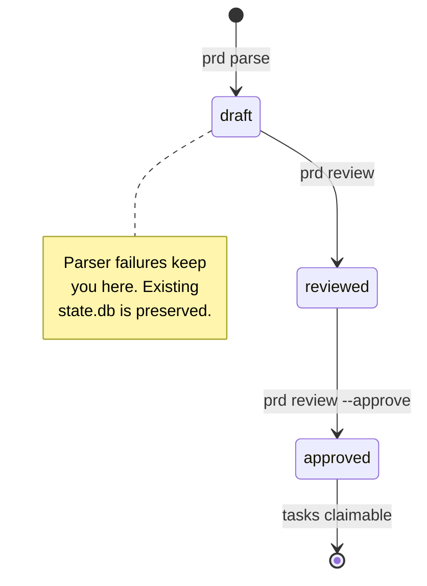

# Authoring a PRD

> The PRD is the canonical source of truth for what gets built. Get the structure right
> and the deterministic parser does the rest — requirements, features, and tasks all
> derive from one markdown file.

This guide assumes you have already run `fakoli-state init` and seen the generated
`.fakoli-state/prd.md`. For the canonical schema, see
[`../prd-template.md`](../prd-template.md). For an end-to-end first run, see
[getting-started.md](getting-started.md).

---

## The PRD lifecycle

Three statuses, two gates, one source file:

| Status     | Meaning                                                                 |
|------------|-------------------------------------------------------------------------|
| `draft`    | The file exists; either never parsed or just re-parsed. No tasks claimable. |
| `reviewed` | `prd parse` succeeded and you ran `prd review`. Still not claimable.    |
| `approved` | `prd review --approve` ran. Tasks in `ready` status can now be claimed. |



The `prd_status_gate` in
[`state/transitions.py`](../../bin/src/fakoli_state/state/transitions.py) enforces the
final hop: `ready → claimed` refuses while the PRD is still `draft`. (As of v1.10.0 the
gate accepts both `reviewed` and `approved` — see
[architecture.md → Gates on the lifecycle](../architecture.md#gates-on-the-lifecycle).)

---

## The template contract

The full schema lives in [`../prd-template.md`](../prd-template.md). The deterministic
parser at
[`planning/template.py`](../../bin/src/fakoli_state/planning/template.py) extracts these
sections in this order:

| Section                | Required | Stored as                  |
|------------------------|----------|----------------------------|
| `# Project: <Name>`    | yes      | Project display name       |
| `## Summary`           | yes      | `PRD.summary` (string)     |
| `## Goals`             | yes      | `PRD.goals` (list)         |
| `## Non-Goals`         | no       | `PRD.non_goals` (list) — keeps scope tight |
| `## Requirements`      | yes      | `Requirement` rows (R001, R002, …) |
| `## Acceptance Criteria` | no     | `PRD.acceptance_criteria` (list) |
| `## Risks`             | no       | `PRD.risks` (list)         |
| `## Open Questions`    | no       | `PRD.open_questions` (list) |
| `## Features`          | no       | `Feature` rows (F001, F002, …) |
| `## Tasks`             | no       | `Task` rows (T001, T002, …) |

A missing required section produces a `ParseError` and the existing `state.db` is
preserved untouched. A missing optional section silently defaults to an empty list and
parsing continues.

**Provide IDs explicitly.** Auto-assigned IDs shift when you insert a new bullet above
an existing one, breaking every cross-reference. Write `- R001: ...` not just `- ...`.

---

## A real-ish example

Here is a self-contained PRD for adding JSONL audit export to the `status` command.
Drop this into `.fakoli-state/prd.md` and run `prd parse` to see the full round-trip.

```markdown
# Project: status-jsonl-export

## Summary

Extend the existing `fakoli-state status` command with an opt-in JSONL export so audit
tooling can stream per-run snapshots without parsing the human-readable output. Targets
operators integrating fakoli-state output into external dashboards.

## Goals

- Add a `--format jsonl` flag that emits one JSON object per task to stdout.
- Preserve the existing default human-readable output exactly (no behaviour change without the flag).
- Include enough fields per row that downstream tooling does not need a second CLI call.

## Non-Goals

- Streaming output via a long-lived subscription (one-shot dump only).
- Schema versioning negotiation — v1 schema is implicit; bump the CLI version on breaks.
- Filtering by status / priority at the CLI layer — consumers can `jq` the stream.

## Requirements

- R001: `status` accepts a `--format` option with values `text` (default) and `jsonl`.
- R002: With `--format jsonl`, the command writes one JSON object per task to stdout, newline-delimited.
- R003: Each JSON object includes `id`, `title`, `status`, `priority`, `feature_id`, `claimed_by`, `updated_at`.
- R004: Without `--format jsonl`, output is byte-identical to the pre-change behaviour.
- R005: Invalid `--format` values exit 2 with a usage message naming the accepted values.
- R006: Exit code is 0 on a successful dump even when zero tasks exist (empty stream is valid).

## Acceptance Criteria

- `fakoli-state status --format jsonl | jq -s 'length'` returns the task count.
- `fakoli-state status` output is unchanged across the upgrade (golden-file test passes).
- `fakoli-state status --format bogus` exits 2 with a Typer usage message.

## Risks

- Schema drift between this dump and the canonical `Task` model — pin the field list in code, not config.
- `updated_at` timezone formatting may vary on hosts with non-UTC locales; emit ISO-8601 with explicit `Z`.

## Open Questions

- Should the dump include `Score` fields, or is that a separate `--format jsonl-full`?

## Features

### F001: JSONL output mode

Adds the `--format jsonl` code path and the per-row JSON shape.

**Requirements:** R001, R002, R003

### F002: Output mode validation

Validates `--format` values at the CLI boundary and preserves the existing default.

**Requirements:** R004, R005, R006

## Tasks

### T001: Add --format option to status command

**Feature:** F001
**Priority:** high
**Likely files:** bin/src/fakoli_state/cli/status.py

Add a `--format` Typer Option with choices `text` and `jsonl`, defaulting to `text`. Wire
the parsed value through to a new dispatch function; do not change the existing renderer
on the default branch.

**Acceptance criteria:**

- `status --format text` produces output byte-identical to pre-change.
- `status --format jsonl` reaches the new code path.
- `status --format bogus` exits 2 with a usage message.

**Verification:**

- `pytest tests/test_cli_status.py -v`
- `fakoli-state status --format text | diff - tests/golden/status-text.txt`

### T002: Implement JSONL row renderer

**Feature:** F001
**Priority:** high
**Likely files:** bin/src/fakoli_state/cli/status.py, bin/src/fakoli_state/cli/_render.py

Build a pure function `render_jsonl(tasks: list[Task]) -> Iterator[str]` that yields one
JSON string per task with the field list from R003. Use `model_dump(mode="json")` to
guarantee ISO-8601 timestamps.

**Acceptance criteria:**

- Each yielded line round-trips through `json.loads`.
- Field set matches R003 exactly (no extras, no missing).
- Empty input yields zero lines and the function returns cleanly.

**Verification:**

- `pytest tests/test_render_jsonl.py -v`
```

Run the parser against it:

```text
$ fakoli-state prd parse
Parsed 6 requirements, 2 features, 2 tasks.
PRD source: /your/project/.fakoli-state/prd.md
```

The parser writes a `prd.parsed` event with the full payload (summary, goals,
non-goals, requirements list, acceptance criteria, risks, open questions). Features and
tasks are emitted as separate entities. PRD status is now `draft`.

---

## Gates: draft → reviewed → approved

Two CLI calls, two events, two human checkpoints:

```bash
# 1. You read the parser output and confirm the requirements look right.
fakoli-state prd review
# → PRD reviewed by 'human'.
# → Run `fakoli-state prd review --approve` to approve.

# 2. You sign off — tasks can now be claimed.
fakoli-state prd review --approve
# → PRD approved by 'human'.
```

The two-step gate is intentional. `prd review` is an explicit "I have read the
deterministic parse output and the requirements list is what I meant to write." Approval
is a separate "I am ready for agents to start work." Skipping the first step fails
loudly:

```text
$ fakoli-state prd review --approve
Error: PRD must be in 'reviewed' status to approve, got 'draft'.
Run `fakoli-state prd review` first.
```

Symmetrically, calling `prd review` when the PRD is already `reviewed` or `approved`
also fails — the command is single-shot per state.

Pass `--reviewer NAME` and `--notes "..."` to record who reviewed and why. The values
are stored verbatim on the `prd.reviewed` / `prd.approved` event and surface in the
audit log.

---

## Iterating on a PRD

PRDs are not write-once. The expected loop:

1. Edit `.fakoli-state/prd.md`.
2. Re-run `fakoli-state prd parse`.
3. Re-run the gates: `prd review`, then `prd review --approve`.

**Re-parse replaces, not merges.** Every `prd parse` invocation completely replaces the
`Requirement`, `Feature`, and `Task` entities in `state.db`. There is no diff, no merge,
no preservation of hand-edits on individual rows. This is documented at
[`prd-template.md` → Parser Behavior at a Glance](../prd-template.md#parser-behavior-at-a-glance).

The replacement extends to tasks already in `claimed` or `in_progress` status. **Coordinate
with active agents before re-parsing a live project** — releasing their claims first via
`fakoli-state release` keeps the audit log clean.

Because IDs are stable when written explicitly (`R001:` rather than bare `-`), edits
that re-order or insert items preserve cross-references. Auto-assigned IDs do not; the
parser walks the bullet list in document order.

---

## LLM augmentation (optional)

The deterministic template parser is always available and free. LLM augmentation is
opt-in and adds nothing structural — it only enriches text fields the deterministic
engine already produced.

### What `--use-llm` adds

Per [`../llm.md`](../llm.md), three commands accept `--use-llm`:

- `plan --use-llm` — extends short task descriptions (under 50 characters) after the
  deterministic parse.
- `score [TASK_ID] --use-llm` — appends a 1-3 sentence trade-off summary to the
  rule-based score explanation. **The numeric scores themselves are never modified by
  the LLM.**
- `expand TASK_ID --use-llm` — proposes 2-5 sub-tasks for tasks with
  `complexity >= 4`. This is the one command where `--use-llm` is required; the
  deterministic engine never invents sub-tasks.

The `prd parse` command itself does **not** expose `--use-llm` on the CLI. Augmentation
of short task descriptions runs as part of `plan --use-llm`, which re-derives tasks from
the same PRD.

### Setup

```bash
export ANTHROPIC_API_KEY="sk-ant-..."
fakoli-state plan --use-llm
```

The default model is `claude-sonnet-4-6`. Prompt caching is on by default — the system
block is sent with an ephemeral cache breakpoint, so repeated runs against the same task
batch pay only for new user tokens within the 5-minute cache window.

### Failure mode

Missing API key with `--use-llm` exits cleanly with code 1 — no partial state is written:

```text
$ fakoli-state plan --use-llm
Error: --use-llm requires ANTHROPIC_API_KEY in environment. Set it or omit --use-llm.
```

Mid-operation LLM errors fall back to deterministic-only output with a warning to
stderr. The operation does not abort. See [`../llm.md` → Failure mode](../llm.md#failure-mode)
for the full contract.

### Recommendation

Use the deterministic path until you actually need richer scoring explanations or
sub-task proposals on a complex task. Most PRDs ship without ever invoking the LLM.

---

## Common failure modes

| Symptom | Cause | Fix |
|---|---|---|
| `Parsed 0 requirements` | `## Requirements` is empty or items are prose paragraphs, not bulleted | Write each requirement as a `- ` bullet. The parser only walks `_BULLET_RE` matches inside the section. |
| `Missing required '## Summary' section.` | Section heading misspelled or omitted | Use exact heading text shown in [`../prd-template.md`](../prd-template.md). Headings are case-insensitive after lowercasing but the word must match. |
| `Task 'T001' references unknown feature 'F001'` | `**Feature:** F001` written but no matching `### F001:` heading exists | Add the feature block under `## Features`, or remove the cross-reference. The parser warns and continues. |
| `Task 'T001' has no **Feature:** field` | Task block lacks a `**Feature:**` line | Add the field. Empty `feature_id` is allowed but creates an unowned task. |
| Scope creep in inferred features | `## Non-Goals` absent or vague | Add explicit out-of-scope items. The planner agent reads this section to bound feature inference. |
| `--use-llm` exits with `ANTHROPIC_API_KEY` error | Env var not exported in the current shell | Run `export ANTHROPIC_API_KEY=sk-ant-...` and retry, or drop the flag. |
| Re-parse silently drops a hand-edited task description | Re-parse replaces all task rows from `prd.md`; in-DB edits are not preserved | Make the change in `prd.md` itself, then re-parse. The PRD file is the source of truth. |

---

## Where to next

- [Claim and ship the first task](claiming-and-shipping-a-task.md) — the agent-side
  workflow once approval is in place.
- [`../prd-template.md`](../prd-template.md) — the canonical schema and field-level
  contract.
- [`../llm.md`](../llm.md) — full `--use-llm` reference, prompt caching, and the
  `RecordedLLMProvider` test pattern.
- CLI reference for `prd` subcommands: [`prd parse`](../cli-reference.md#prd-parse)
  and [`prd review`](../cli-reference.md#prd-review) — flags, exit codes, options.
- [`../architecture.md` → Task lifecycle](../architecture.md#task-lifecycle) — how
  `prd_status_gate` interacts with task claiming.
