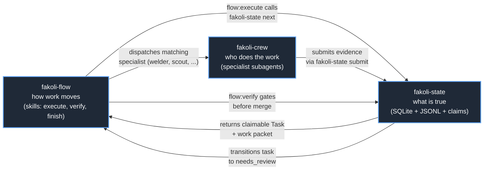

# Integrating with fakoli-flow and fakoli-crew

> fakoli-flow defines how work moves, fakoli-crew defines who does the work,
> and fakoli-state defines what is true. This how-to explains what changes
> when each plugin is installed alongside fakoli-state and how the three
> compose at runtime. Source: [`_positioning.md`](../_positioning.md).

This doc is the canonical answer to "what happens when I install all three?"
If you only need the high-level diagram, see
[`architecture.md` → Integration with fakoli-flow and fakoli-crew](../architecture.md#integration-with-fakoli-flow-and-fakoli-crew).

---

## Plugin trinity



Source: [`assets/diagrams/trinity.mmd`](../../assets/diagrams/trinity.mmd).

Three properties make this composition safe:

- **Explicit detection.** Every skill and agent that bridges to a sibling
  plugin runs `claude plugin list 2>/dev/null | grep -q "fakoli-flow"` (or
  `fakoli-crew`) before invoking it. No prose introspection — the shell
  exit code is the contract.
- **Graceful fallback.** When a sibling is absent, the skill or agent runs
  its plugin-local equivalent. The bridges are no-ops, not hard failures.
- **State is the rendezvous.** Flow does not call crew directly to ask for
  a result; crew submits evidence to fakoli-state, and flow polls state's
  `needs_review` queue. This bounds each plugin's blast radius.

---

## What changes when each plugin is installed

| Capability | fakoli-state alone | + fakoli-flow | + fakoli-flow + fakoli-crew |
|---|---|---|---|
| PRD authoring | `start-prd` skill — six-question interview, writes `prd.md` | `start-prd` bridges to `/fakoli-flow:brainstorm` (richer guided design, optional visual companion), then translates the spec to PRD template | same; `planner` agent additionally defers architecture questions to `fakoli-crew:guido` |
| Planning | `plan` CLI + plugin-owned `planner` agent | `/flow:plan` consumes `fakoli-state plan` output and groups Tasks into dependency-ordered waves | crew specialists assigned per Task `agent_suitability` score |
| Claiming | `claim` skill (solo loop) | `/flow:execute` calls `fakoli-state next` then `fakoli-state claim` per wave | crew agents (`welder`, `scout`, ...) own the claim; `--actor fakoli-crew:welder` tags the Claim row |
| Execution | `execute` skill — solo agent, one task at a time | `/flow:execute` orchestrates parallel waves; each wave runs this skill's steps internally | crew specialists take work-packets; `welder` for integration, `scout` for research |
| Code review | plugin-owned `critic` agent (acceptance-criteria contract check) | `/flow:execute` runs the critic gate after every wave that writes code | `fakoli-crew:critic` takes precedence — language-deep review (Python, TypeScript, Rust); plugin-owned `critic` becomes the fallback |
| Verification | plugin-owned `sentinel` agent (re-runs verification commands) | `/flow:verify` dispatches sentinel on submitted-evidence tasks before merge | `fakoli-crew:sentinel` takes precedence — broader validation (CI workflows, version sync, comprehensive linting); plugin-owned `sentinel` becomes the fallback |
| Ship | `apply` CLI + plugin-owned `state-keeper` for drift | `/flow:finish` calls `fakoli-state apply --approve` per accepted task, then `gh pr create` (Phase 8) | `fakoli-crew:keeper` handles repo-wide cleanup (CLAUDE.md, CI, registry); plugin-owned `state-keeper` keeps the narrower drift scope inside one initialized project |

The plugin-owned skills and agents always exist. The bridges and defers are
additive — they switch in richer behaviour when the sibling is detected,
and switch out cleanly when it is not.

---

## Specific integration examples

### Example 1: `/flow:execute` consumes `fakoli-state next` + `claim` + `submit`

When all three plugins are installed, a single `/flow:execute` invocation
walks every wave through the fakoli-state lifecycle:

1. `/flow:execute` reads the plan file and groups Tasks into waves by
   dependency. It runs `claude plugin list 2>/dev/null | grep fakoli-crew`
   once at the start and logs the detected version.
2. For each wave, it calls `fakoli-state next` to identify the highest
   priority claimable Task (priority order: `critical` > `high` > `medium`
   > `low`, ties broken by complexity ascending then `created_at`).
3. It calls `fakoli-state claim T012 --actor fakoli-crew:welder` to acquire
   the 60-minute lease and create the `agent/t012-<slug>` branch.
4. It dispatches the matching crew specialist via the Agent tool. The
   specialist runs the [`execute` skill](../../skills/execute/SKILL.md)
   internally: fetches the work packet, does the work, runs verification,
   submits evidence via `fakoli-state submit T012 --commands ... --files-changed ...`.
5. After the wave's tasks all reach `needs_review`, `/flow:execute` runs
   the critic gate (`fakoli-crew:critic` when present, else the plugin-owned
   `critic`). The gate returns PASS, SHOULD FIX, or MUST FIX.
6. On critic PASS (or SHOULD FIX with no MUST FIX), the wave proceeds.
   On MUST FIX, the welder is re-dispatched (up to 3 iterations) before
   escalating to the user.
7. After all waves complete, `/flow:verify` dispatches the sentinel for
   final evidence validation, then `/flow:finish` calls `fakoli-state apply --approve`
   for every accepted Task.

The fakoli-state CLI is the only writer to `state.db` and `events.jsonl`
throughout. Flow and crew never touch the storage layer directly — they
shell out to the CLI, which means every action they take appears in
`events.jsonl` and the replay guarantee holds end to end.

### Example 2: The "defer to fakoli-crew" pattern across the six plugin-owned agents

Each plugin-owned agent declares its defer-to relationship in its
frontmatter `description` and reinforces it in a "Composition with
fakoli-crew" section in the prompt body. The mechanical detection happens
the same way in every case:

```bash
claude plugin list 2>/dev/null | grep -q "fakoli-crew"
```

Exit code 0 means defer; non-zero means run the plugin-owned body. The six
agents and what each defers to:

| Plugin-owned agent | Defers to | Defer style |
|---|---|---|
| [`critic`](../../agents/critic.md) | `fakoli-crew:critic` for language-deep review (Python type annotations, TypeScript strictness, Rust lifetimes) | Full takeover; plugin-owned `critic` becomes the fallback for acceptance-criteria contract checks |
| [`sentinel`](../../agents/sentinel.md) | `fakoli-crew:sentinel` for comprehensive validation (CI workflow checks, version sync, broad linting) | Full takeover; plugin-owned `sentinel` becomes the fallback for re-running task-spec verification commands |
| [`planner`](../../agents/planner.md) | `fakoli-crew:guido` for high-level architecture decisions (interface design, type system choices, project structure) | Partial — `planner` keeps WHAT/scoping/decomposition, defers HOW/architecture questions; flags those as a "guido consult" in its Concerns section |
| [`state-keeper`](../../agents/state-keeper.md) | `fakoli-crew:keeper` for repo-wide infrastructure (CLAUDE.md, `.github/workflows/`, contributor docs, multi-plugin registry regen) | Scope-split — `state-keeper` keeps drift detection inside one initialized fakoli-state project (orphan branches, orphan packets, stale claims, missing sync_mappings); `fakoli-crew:keeper` owns everything else |
| [`marketplace-scribe`](../../agents/marketplace-scribe.md) | `fakoli-crew:keeper` for repo-wide regeneration (whole marketplace.json from scratch, schema changes affecting every plugin) | Scope-split — `marketplace-scribe` keeps the fakoli-state row in marketplace.json, README plugins table, and `registry/*.json`; everything broader routes to keeper |
| [`docs-scribe`](../../agents/docs-scribe.md) | `fakoli-crew:herald` for outward-facing documentation (root README, marketplace blurb prose, badges, first-time-visitor copy) | Scope-split — `docs-scribe` keeps inward-facing docs under `plugins/fakoli-state/docs/`, the plugin's CHANGELOG, and `plugin.json`'s `description` field; everything stranger-facing routes to herald |

Two of the six (`critic`, `sentinel`) are full fallbacks: when the crew
sibling exists, the plugin-owned agent steps aside entirely. The other
four (`planner`, `state-keeper`, `marketplace-scribe`, `docs-scribe`) are
scope-splits: both run, but at different levels of granularity. The
split-by-scope pattern is deliberate — it lets each plugin own a tightly
defined surface without the two agents fighting over the same files.

### Example 3: Standalone mode (just fakoli-state)

When neither fakoli-flow nor fakoli-crew is installed, fakoli-state is fully
functional on its own. What still works:

- **All 23 CLI commands** (14 top-level + 9 sub-app commands across `prd`,
  `review`, `sync`, and `hook`). Full list with flags and exit codes in
  [`../cli-reference.md`](../cli-reference.md).
- **All 13 MCP tools** exposed via the FastMCP stdio server — any
  MCP-compatible client (Claude Code, Codex, Cursor, OpenHands, Copilot)
  can call them.
- **All 7 skills** (`start-prd`, `prd`, `plan`, `claim`, `execute`,
  `finish`, `state-ops`). They detect the absence of `fakoli-flow` and run
  their self-contained bodies — six-question interview in `start-prd`,
  solo execution loop in `execute`, solo review loop in `finish`.
- **All 6 plugin-owned agents** — `critic`, `sentinel`, `planner`,
  `state-keeper`, `marketplace-scribe`, `docs-scribe`. They execute their
  full body without delegating.
- **All 4 hooks** — `detect-state` (SessionStart), `check-claim`
  (PreToolUse Edit/Write/NotebookEdit), `record-file-change` (PostToolUse
  Edit/Write/NotebookEdit), `capture-evidence` (PostToolUse Bash).

This is the v0 wedge: no external plugin dependency for the core state
engine. A solo developer with one Claude Code session can drive the full
PRD-to-shipped lifecycle without ever installing flow or crew.

---

## Install order (recommendation)

1. **Install fakoli-state first.** It is the durable record; flow and crew
   are stateless relative to it. With fakoli-state alone you already get
   PRD authoring, planning, claiming, execution, evidence, and apply.
2. **Install fakoli-flow next.** It adds the wave-engine orchestration —
   `/flow:execute` dispatches agents in parallel waves with critic gates
   between them. The skills in fakoli-state's `start-prd`, `execute`, and
   `finish` automatically bridge to flow's richer equivalents.
3. **Install fakoli-crew last.** It adds the specialist subagents that the
   wave-engine dispatches. The six plugin-owned agents in fakoli-state
   automatically defer (or scope-split) to their crew counterparts.

The install order is a recommendation, not a requirement. The integration
is detection-based, not install-order-dependent — installing crew before
flow, or flow before state, also works. Each plugin's detection check
fires on demand at the moment a skill or agent runs.

---

## Detection mechanics

The shell check that appears in every bridging skill and deferring agent:

```bash
claude plugin list 2>/dev/null | grep -q "<plugin-name>"
```

- The `2>/dev/null` suppresses stderr when `claude` itself is not on
  `PATH` (this can happen in some MCP server contexts).
- The grep pattern is intentionally unanchored. Actual `claude plugin list`
  output is rendered as `  ❯ fakoli-crew@fakoli-plugins` (two-space indent,
  arrow marker, then the `<plugin>@<source>` slug); a leading `^` anchor
  would never match the indented line. The unanchored substring match is
  safe because the `fakoli-crew` and `fakoli-flow` plugin names are unique
  within the marketplace — no other installed plugin contains those strings.
- The exit code is the contract. Skill and agent prose never tries to
  introspect a tool list, parse JSON, or guess from the `/help` output.

This mechanical approach has two advantages over metadata-based detection:

1. **Cross-version compatibility.** Claude Code's plugin manifest schema
   has evolved; a `claude plugin list` exit code remains a stable
   primitive across versions.
2. **Skill files stay readable.** A one-line shell check is easier to
   audit and review than a structured manifest dependency that has to be
   declared, validated, and wired through tooling.

Every skill that calls a sibling plugin documents its detection check
explicitly. See [`skills/start-prd/SKILL.md`](../../skills/start-prd/SKILL.md)
Step 1, [`skills/execute/SKILL.md`](../../skills/execute/SKILL.md)
"Composition with Other Skills", [`skills/finish/SKILL.md`](../../skills/finish/SKILL.md)
"Composition with Other Skills", and [`skills/claim/SKILL.md`](../../skills/claim/SKILL.md)
"Composition with Other Skills" for the canonical examples.

---

## Common patterns

### "I want fakoli-state but not the wave-engine ceremony"

Install only fakoli-state. Use the plugin-owned `claim`, `execute`, and
`finish` skills directly. They orchestrate one Task at a time without
dispatching multi-agent waves. The full PRD-to-shipped path works with a
single human-plus-agent pair.

This is the right shape for solo development, small teams, and any
project where the overhead of wave coordination outweighs the parallelism
benefit. The fakoli-state skills are designed for this mode first; the
fakoli-flow bridge is the upgrade path, not the default.

### "I want the wave-engine but my project doesn't need durable state"

Install only fakoli-flow + fakoli-crew. They fall back to their
markdown-status-file convention — agent status files written to
`docs/plans/agent-<name>-status.md` for each dispatched specialist.
fakoli-state is opt-in: when it is present, flow and crew submit
evidence through it; when it is absent, they write status markdown.

This works for short-lived projects where the state does not need to
survive a session reset, model swap, or merge. It loses the audit log,
the replay guarantee, the lease model, and the conflict-group routing —
those only exist when fakoli-state is installed.

### "I want all three but want to swap out a specific crew agent"

The defer-to pattern is one-way: plugin-owned agents check for crew
presence and defer (or scope-split). If you want a plugin-owned agent to
handle a specific class of work even when crew is installed, the simplest
intervention is to edit the defer check in the agent's `.md` file in
place — comment out the dispatch and keep the local body.

A more principled override mechanism (a settings.json toggle, a per-task
agent assignment, or a `defer-overrides.yaml` file) is not yet shipped.
NEEDS_REVIEW: there is no `settings.json` schema for defer overrides in
the current plugin manifest. Track this on the roadmap if it matters for
your project.

---

## Where to next

- [Architecture: the plugin trinity diagram and integration section](../architecture.md#integration-with-fakoli-flow-and-fakoli-crew)
- [Positioning: the trinity sentence and the five wedges](../_positioning.md)
- [Getting started: install + first PRD + first claim](getting-started.md)
- [Authoring a PRD: the template schema and worked example](authoring-a-prd.md)
- [Skills reference: the seven plugin-owned skills with their bridge points](../skills-reference.md)
- The wave-engine dispatch source: [`fakoli-flow/skills/execute/SKILL.md`](https://github.com/fakoli/fakoli-plugins/blob/main/plugins/fakoli-flow/skills/execute/SKILL.md)
- The crew agent roster: [`fakoli-crew/agents/`](https://github.com/fakoli/fakoli-plugins/tree/main/plugins/fakoli-crew/agents)
