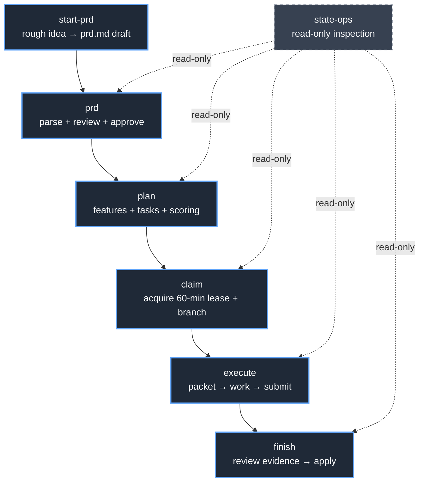

# Skills reference

> fakoli-state ships 7 skills that orchestrate workflows around the CLI. Each
> skill has a trigger phrase (the slash command), a step-by-step procedure,
> and optional bridges to `fakoli-flow` or `fakoli-crew` skills when those
> plugins are installed. This reference indexes each skill, names its source
> file, and surfaces every bridge.

The skills are pure markdown choreography — they call the CLI, read its
output, and prompt the user one decision at a time. None of them write
directly to `state.db` or `events.jsonl`. See
[`architecture.md` → Component layers](architecture.md#component-layers)
for the architectural placement.

---

## Skill dependency graph



The six lifecycle skills run in order on the happy path: an idea becomes a
PRD, the PRD becomes a task graph, tasks get claimed and worked, and
evidence ships. `state-ops` is the orthogonal read-only utility — safe to
invoke at any point in any session without changing state.

---

## State-ops

**Trigger:** `/fakoli-state:state-ops`

**Purpose:** Inspect the canonical SQLite state without mutating it. Wraps
`fakoli-state status`, `list`, `show`, `next`, `conflicts`, and `sync`
(reconciliation-only mode).

**When to use:**

- Orienting at the start of any session — run `status` first, always.
- Before claiming a task — confirm the PRD is approved and the task is `ready`.
- When a claim was interrupted and the state of the queue is unclear.
- When multiple agents are active and conflict risk is non-trivial.
- When suspicious that orphan branches or stale packets exist on disk.

**Bridges to fakoli-flow:** None. This skill is read-only and self-contained.

**Source:** `skills/state-ops/SKILL.md`

**See also:** [`cli-reference.md`](cli-reference.md) for the underlying CLI
commands, [`mcp.md`](mcp.md) for the equivalent MCP read-only tools.

---

## Start-PRD

**Trigger:** `/fakoli-state:start-prd`

**Purpose:** Turn a rough idea into a structured PRD draft via one-question-
at-a-time Q&A, then write the result to `.fakoli-state/prd.md` so
`fakoli-state prd parse` can consume it.

**When to use:**

- The user has an idea ("I want to build a CLI that converts CSV to Parquet")
  but no PRD yet.
- `fakoli-state status` reports `prd-status: none` and the user is not ready
  to write the template by hand.
- A rough scope was discussed in chat and now needs to be captured as a
  structured document.

**Bridges to fakoli-flow:** When `fakoli-flow` is installed, this skill
prefers `/fakoli-flow:brainstorm` for its richer guided design dialogue
(scope check, section-by-section presentation, optional visual companion).
The skill then translates the resulting spec into the `fakoli-state` PRD
template format. Standalone, it falls back to a deterministic six-question
interview loop.

**Detection logic** (from `skills/start-prd/SKILL.md` Step 1):

```bash
claude plugin list 2>/dev/null | grep -q "fakoli-flow"
```

Exit code 0 means bridge to `/fakoli-flow:brainstorm`. Non-zero means the
plugin is absent (or `claude` itself is not on `PATH`) — fall through to
the six-question interview.

**Source:** `skills/start-prd/SKILL.md`

**See also:** [`how-to/authoring-a-prd.md`](how-to/authoring-a-prd.md) for
the canonical PRD template structure.

---

## PRD

**Trigger:** `/fakoli-state:prd`

**Purpose:** Author, parse, and review the project PRD. The PRD is the
single source of truth for every `Requirement`, `Feature`, and `Task` row
in `state.db`. Nothing can be claimed until this document exists, parses
cleanly, and clears the review gate.

**When to use:**

- Starting a new project — before any planning, scoring, or task assignment.
- Revising the PRD after stakeholder feedback changes scope or acceptance criteria.
- Recovering after a scope change mid-project — re-anchor what the work is
  before resuming claims.
- Before any invocation of `/fakoli-state:plan` — planning reads from a
  parsed PRD; authoring must come first.

**Bridges to fakoli-flow:** None at the skill level. LLM-assisted PRD
drafting through `fakoli-flow` is referenced from the `start-prd` skill
(see above); the `prd` skill itself operates on `.fakoli-state/prd.md`
directly via `fakoli-state prd parse` / `review` / `review --approve`.

**Source:** `skills/prd/SKILL.md`

**See also:** [`how-to/authoring-a-prd.md`](how-to/authoring-a-prd.md),
[`prd-template.md`](prd-template.md) for the canonical schema.

---

## Plan

**Trigger:** `/fakoli-state:plan`

**Purpose:** Convert an approved PRD into a queue of agent-ready tasks.
Drives four sequential state transitions: PRD requirements → features and
tasks → scored tasks → reviewed-and-ready tasks.

**When to use:**

- Immediately after `fakoli-state prd review --approve` — the PRD is
  approved and the task graph does not yet exist.
- After a significant PRD revision that adds new `## Features` or `## Tasks`
  sections — re-plan to generate the updated task graph.
- When `fakoli-state status` shows `prd-status: approved` but
  `ready-tasks: 0` and no tasks exist yet.

**Bridges to fakoli-flow:** None at the skill level. When `fakoli-flow` is
installed, its `/flow:plan` skill consumes `fakoli-state plan` output and
groups tasks into dependency-ordered waves — but the bridge runs in the
other direction (flow calls into state). This skill itself stays local.

**Source:** `skills/plan/SKILL.md`

**See also:**
[`how-to/integrating-with-fakoli-flow-and-crew.md`](how-to/integrating-with-fakoli-flow-and-crew.md)
for how `/flow:plan` consumes `fakoli-state plan` output.

---

## Claim

**Trigger:** `/fakoli-state:claim`

**Purpose:** Acquire an exclusive 60-minute lease on a `ready` task. Picks
from the queue, checks for file conflicts, claims the task, and creates the
git branch `agent/<task_id_lower>-<slug>` to commit into.

**When to use:**

- Starting work on a task after `/fakoli-state:plan` has produced a ready queue.
- When `fakoli-flow:execute` dispatches an agent against a fakoli-state
  task — the claim step happens inside that dispatch.
- When resuming after an interrupted session — check `fakoli-state status`
  first, then re-claim if the previous lease has expired and the task
  returned to `ready`.
- When coordinating parallel agents — each agent claims a separate task;
  `claim` enforces the conflict gate.

**Bridges to fakoli-flow:** When `fakoli-flow` is installed, `flow:execute`
wraps this skill — it reads `fakoli-state next`, calls `fakoli-state
claim`, and dispatches the agent against the claimed task. The claim still
appears in `state.db`; it is the same primitive, called from inside the
flow. Solo agents invoke this skill directly.

**Bridges to fakoli-crew:** When `fakoli-crew` is installed, `welder` is
the standard claim consumer for integration work and `scout` is the
standard consumer for research tasks. Pass `--actor` to tag the claim with
the crew role for traceability:

```bash
fakoli-state claim T012 --actor fakoli-crew:welder
```

**Source:** `skills/claim/SKILL.md`

**See also:** [`cli-reference.md`](cli-reference.md) for the underlying
`claim`, `release`, `renew`, and `next` commands.

---

## Execute

**Trigger:** `/fakoli-state:execute`

**Purpose:** Carry a claimed task all the way to `needs_review`: fetch the
work packet, read it in full, do the work, heartbeat the lease, run
verification, and submit evidence. Covers the solo-agent path.

**When to use:**

- After `fakoli-state claim TASK_ID` has succeeded — claim ID and branch in hand.
- When `fakoli-flow:execute` is NOT installed. When it IS installed, prefer
  that skill — it wraps this one with wave orchestration and critic gates.
- For solo execution: one agent, one task, one branch, straight to submit.

**Bridges to fakoli-flow:** When `fakoli-flow:execute` is installed, that
skill wraps this one. It reads `fakoli-state next`, calls `fakoli-state
claim`, dispatches agents against non-overlapping tasks in parallel waves,
gates waves with critic review, and coordinates submit timing. Solo agents
use this skill directly; orchestrated agent teams use `/fakoli-flow:execute`,
which calls each step here in sequence for each wave.

**Bridges to fakoli-crew:** When `fakoli-crew` is installed, `welder` is
the standard executor for integration tasks; `scout` claims research
tasks. Each crew agent runs this skill's steps internally, tagged with
`--actor fakoli-crew:welder` on claim. The execute loop is identical; the
actor identity differs.

**Source:** `skills/execute/SKILL.md`

**See also:**
[`how-to/integrating-with-fakoli-flow-and-crew.md`](how-to/integrating-with-fakoli-flow-and-crew.md)
for the full wave-engine dispatch example.

---

## Finish

**Trigger:** `/fakoli-state:finish`

**Purpose:** Drive the final leg of the task lifecycle — read the
evidence, pick a disposition (accept and ship, reject and reopen, hold for
investigation, or discard), call `fakoli-state apply`, and hand off to the
project's git workflow for merging.

**When to use:**

- Tasks appear in `fakoli-state list --status needs_review`.
- Before merging a PR that contains fakoli-state-tracked work — confirm the
  task has been applied first.
- At end-of-day or end-of-iteration when deciding what to ship versus what
  to reopen.

**Bridges to fakoli-flow:** When `fakoli-flow:finish` is installed, that
skill wraps this one for wave-based batch completion. It drives `apply` for
all completed tasks in a wave, then triggers automated PR creation via
`gh pr create`. Solo and human-reviewer workflows use this skill directly.
`fakoli-flow:finish` calls `fakoli-state apply` for each task the same
way, but orchestrates the full wave before handing off to git.

**Bridges to fakoli-crew:** When `fakoli-crew` is installed, the `sentinel`
agent validates evidence before the reviewer reaches this skill. The skill
performs the explicit detection check before dispatching sentinel:

```bash
claude plugin list 2>/dev/null | grep -q "fakoli-crew"
```

Exit code 0 means dispatch `fakoli-crew:sentinel` against the task's
evidence bundle before invoking `fakoli-state apply`. Non-zero means fall
through to the plugin-local `sentinel` agent (or rely on the reviewer's
own reading of the evidence). Sentinel produces a pass/fail recommendation
that supplements but does not replace the reviewer's judgment — `apply` is
always a human decision.

**Source:** `skills/finish/SKILL.md`

**See also:** [`github-sync.md`](github-sync.md) for the optional sync-to-
external-tracker step after `apply --approve`.

---

## Composition patterns

### Standalone fakoli-state

Install order: fakoli-state alone. No external plugin dependencies.

All 7 skills run their self-contained bodies end to end: start-prd → prd
→ plan → claim → execute → finish, with state-ops available for inspection
at any point. The detection checks in `start-prd`, `execute`, and
`finish` exit non-zero and the skills fall through to their local
implementations — the six-question interview, the solo execution loop, the
solo review loop. This is the v0 wedge: a solo developer with one Claude
Code session can drive the full PRD-to-shipped lifecycle without ever
installing flow or crew.

### + fakoli-flow

Install order: fakoli-state + fakoli-flow. The start-prd, execute, and
finish skills bridge to their `/flow:*` equivalents; the plan, claim, prd,
and state-ops skills stay local. Specifically:

- `/fakoli-state:start-prd` bridges to `/fakoli-flow:brainstorm` for the
  richer guided design dialogue, then translates the spec back to the
  fakoli-state PRD template.
- `/fakoli-state:execute` is wrapped by `/fakoli-flow:execute`, which adds
  wave-based dispatch, critic gates between waves, and coordinated submit
  timing.
- `/fakoli-state:finish` is wrapped by `/fakoli-flow:finish`, which adds
  wave-level batch apply and automated PR creation.

The wrapping skills still call into the underlying `fakoli-state` CLI —
state is the rendezvous, not flow.

### + fakoli-flow + fakoli-crew

Install order: fakoli-state + fakoli-flow + fakoli-crew (the full
trinity). Same bridges as above for the flow side; additionally the
agents invoked within `/flow:*` skills are crew specialists rather than
plugin-local ones. The `welder` agent handles integration work, `scout`
handles research, `critic` runs language-deep code review, `sentinel`
runs comprehensive validation, and `keeper` handles repo-wide cleanup.
The fakoli-state CLI remains the only writer to `state.db` and
`events.jsonl` throughout — flow and crew never touch the storage layer
directly.

---

## See also

- [Architecture: skills layer](architecture.md#component-layers) — where
  skills sit relative to CLI, MCP, and storage.
- [How-to: integrating with fakoli-flow and crew](how-to/integrating-with-fakoli-flow-and-crew.md)
  — the canonical reference for what happens when all three plugins are
  installed.
- [CLI reference](cli-reference.md) — the underlying commands every skill
  wraps.
- [MCP reference](mcp.md) — the equivalent capabilities for non-Claude
  Code MCP clients.
- [Getting started](how-to/getting-started.md) — install + first PRD +
  first claim, using these skills end to end.
